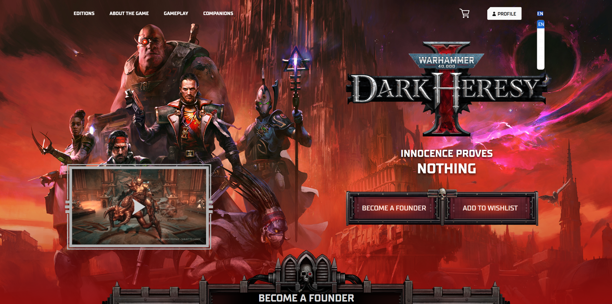

# Баг 002 — Почти невидимый выпадающий список выбора языка

**Описание:**  
На главной странице сайта выпадающий список языков почти не виден до наведения курсора: опции отображаются с низкой прозрачностью или без фонового цвета.

**Шаги для воспроизведения:**
1. Открыть [сайт](https://darkheresy.owlcat.games/?en=)
2. Кликнуть по переключателю языка
3. Посмотреть на выпадающий список языков

**Ожидаемый результат:**  
Пункты списка видны сразу, без наведения курсора

**Фактический результат:**  
Опции почти не видны (низкая прозрачность или отсутствует фон), пока не наведёшь курсор

**Серьёзность:** Незначительный (Minor)  
**Приоритет:** Средний (Medium)

**Окружение:**  
Windows 11 / Chrome 137.0.7151.120

**Скриншот:**  

