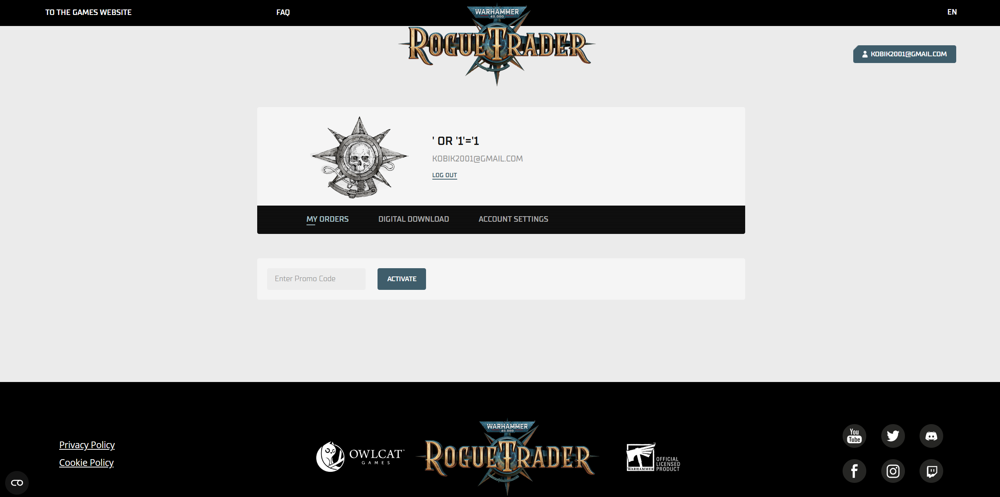

#  Баг 003 — Недостаточная валидация: разрешено использовать SQL-строку в поле имени пользователя при регистрации

**Описание:**  
Поле "Имя пользователя" на странице регистрации принимает SQL-подобные строки (например, `' OR '1'='1`), регистрация с такими данными проходит успешно.

**Шаги для воспроизведения:**
1. Перейти на [страницу регистрации](https://roguetrader.owlcat.games/preorder/en/register)
2. Ввести в поле "Username": `' OR '1'='1`
3. Ввести корректный email и любой пароль
4. Завершить регистрацию

**Ожидаемый результат:**  
Ввод SQL-подобных строк должен блокироваться, пользователь должен получить ошибку "Некорректное имя пользователя"

**Фактический результат:**  
Регистрация проходит успешно, аккаунт создаётся с именем, похожим на SQL-запрос

**Окружение:**  
Windows 11 / Chrome 137.0.7151.120

**Скриншот:**  

