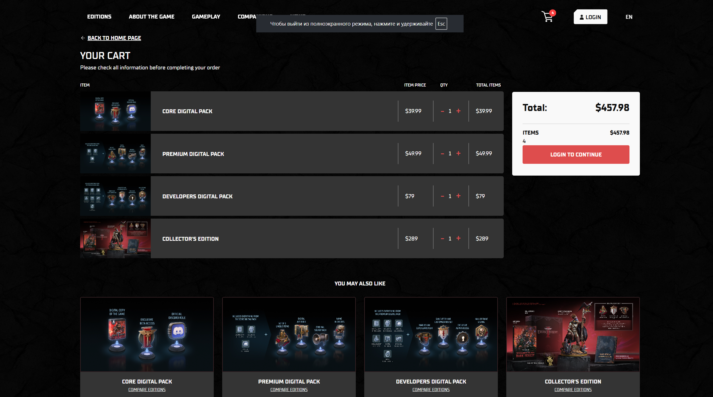
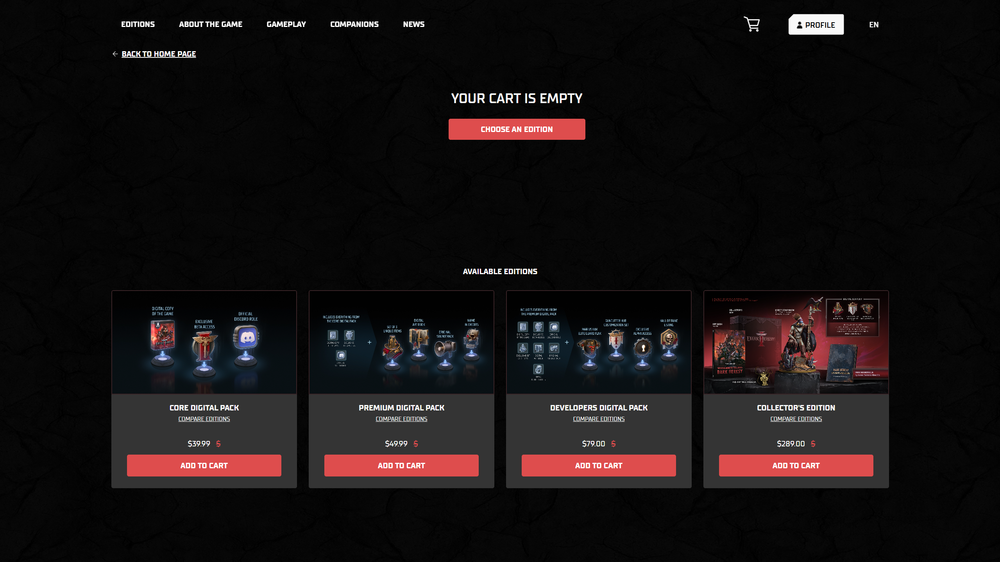

#  Баг 004 — Корзина очищается после авторизации

**Описание:**  
Если добавить продукт в корзину до авторизации, а затем войти в аккаунт, корзина оказывается пустой — добавленные товары теряются.

**Шаги для воспроизведения:**
1. Перейти на [страницу корзины](https://darkheresy.owlcat.games/preorder/en/basket) как неавторизованный пользователь
2. Добавить любой продукт в корзину
3. Перейти к оформлению заказа (checkout) — потребуется вход
4. Войти в аккаунт
5. Открыть корзину снова

**Ожидаемый результат:**  
Товары, добавленные до входа, остаются в корзине после авторизации

**Фактический результат:**  
Корзина пуста, все ранее добавленные товары исчезли

**Заметки:**  
Возможна ошибка на стороне backend или cookie/session. Корзина анонимного пользователя не синхронизируется с корзиной аккаунта при входе.

**Окружение:**  
Windows 11 / Chrome 137.0.7151.120

**Скриншоты:**

До входа:

После входа:

